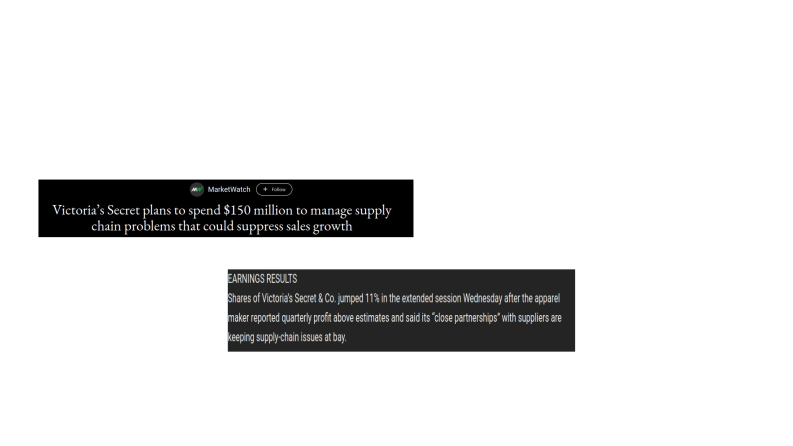
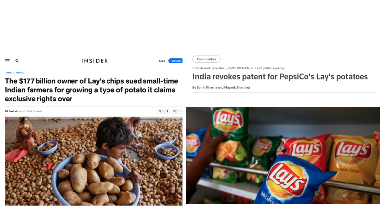
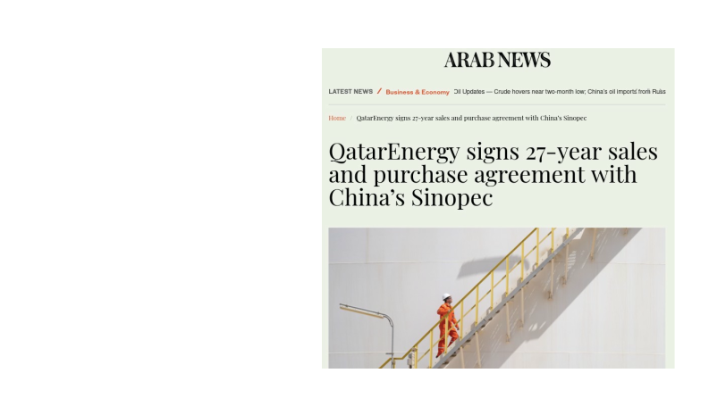

## Business Economics {.title-slide}

::: title-rule
:::

::: title-meta
Marcelo Ortiz M.
:::

## Topic 7: Vertical Integration
- Objectives
- 1) Understand what is a vertical chain of production
- 2) Explain the factors that motivate firms to acquire inputs through non- market transactions
- 3) Define the term “firm-specific assets” and its consequences in contracting with outside suppliers
- 4) Understand the differences between vertical integration and long-term contract

## 1. Vertical chain of production Definition
- As we have discussed before (topics 2 and 3), firms are an economic organization that can reduce contracting costs when they trade (in the production chain).
- And their relative efficiency depends on how their organize internally: decision right allocation, performance evaluation, compensation (topics 4-7)
- But, there are still some important questions.

## 1. Vertical chain of production Definition
- 1) Why do firms differ in their scope in the chain of production?
- 2) Why do firms trade via both the spot-market and long-term contract market?

## 1. Vertical chain of production Definition

::::: columns
::: {.column width="58%"}
- Consists of a series of steps needed for producing the consumer good
- Steps:
  - 1) raw material preparation
  - 2) transportation and storage
  - 3) intermediate-goods process
  - 4) transportation and storage
  - 5) assembling of the consumer good
  - 6) transportation and storage
  - 7) retailer distribution and service
:::

::: {.column width="42%"}
{width="100%"}
:::
:::::

## 2. Vertical Integration and Outsorcing
- Vertical integration: firms participate directly in more than one successive step in the vertical chain.
  - Backward/upstream integration
  - Forward/downstream integration
- Outsourcing: moving away an activity that was formerly done within the firm (reducing vertical integration)
  - It can be done via transacting in:
  - a) the spot market: market transactions
  - b) long-term contract

## 2. Vertical Integration and Outsorcing

::::: columns
::: {.column width="58%"}
- A) Outsourcing and non-market coordination
:::

::: {.column width="42%"}
{width="100%"}
:::
:::::

## 2. Vertical Integration and Outsorcing

::::: columns
::: {.column width="58%"}
- B) Outsourcing risks
:::

::: {.column width="42%"}
{width="100%"}
:::
:::::

## 2. Vertical Integration and Outsorcing

::::: columns
::: {.column width="58%"}
- Long-term agreements
:::

::: {.column width="42%"}
{width="100%"}
:::
:::::

## 3. Transacting in competitive markets vs Integration Benefits of markets
- 1) Suppliers have incentives to reduce the cost of production (adopt new technologies) or enhance quality. The improvements are passed to buyers in the form of lower prices via market competition
- 2) Volume generation and scale economies in production
- 3) Entering a new market reduces the focus on the primary line of business
  - Specialization and competitive advantage
- 4) Inefficient subsidization across divisions within the firm

## 3. Transacting in competitive markets vs Integration Benefits of Integration: Contracting costs and specific assets
- 1) Lower contracting cost: Search of trading partners, negotiating terms and prices, monitoring and enforcing agreements
  - a) Firm-specific assets and the holdup problem: assets of the business partners that are substantially more valuable in their current use than in their next best alternative use. By integrating them into the company the risk of being used in the second best use is reduced (initially, no property rights!)
  - Cases:
  - Location: Harbor and warehouses (Maritime Transportation vs Restaurants)
  - Production specification: specialized machine tool that depends on suppliers’ decision rights (“designs”),
  - Human-asset knowledge: hiring specialized consultants services (vs hiring them directly).

## 3. Transacting in competitive markets vs Integration Benefits of Integration: Contracting costs and specific assets
- The Holdup problem
  - Examples: pricing conflicts, guarantees conflicts
- Integration solves this problem. No renegotiation needed.

## 3. Transacting in competitive markets vs Integration Benefits of Integration: Contracting costs and other benefits
- b) Monitoring quality The buyer might not be able to learn about defective units until long after the purchase: Ex. Batteries in electronics, retailer partners for premium brands. Reputation and warranties can reduce this problem in the spot market. c) Controlling externalities: The free-rider problem among distributors. The buyers (in this case, distributors) have fewer incentives to invest in the brand reputation or customer satisfaction, because they can free-ride other distributors. Ex: Hiring less-skilled employees, shirking on advertising and post-sale service d) Extensive coordination: Complex large-scale operations (railroads) are costly to operate/coordinate via the market-price mechanism

## 3. Transacting in competitive markets vs Integration Benefits of Integration: Market Power and Regulation
- 2) Market power
  - Market power and vertical integration can increase profits because it allows price setting
  - Example: Blockchain Mining Equipment and Services
- 3) Taxes and regulation
  - Different stages of production can be taxed differently
  - Firms in regulated industries where profits are restricted can integrate unregulated segments of the business
  - Fishing companies and fish-based food.

## 4. Vertical integration vs long-term contracts Benefits of Integration over long-term contract
- 1) Long-term contracts rely on incomplete contracts
  - It is impossible for the parties to include in a contract all the possible future contingencies
  - Ex. changes in consumer preferences, disruptive technologies Contracts are expensive to negotiate
  - Self-interested parties Contracts are costly to enforce
  - Ex: lawyers, managerial time.

## 4. Vertical integration vs long-term contracts Benefits of Integration over long-term contract
- 2) Ownership and investment incentives
  - Ownership (property rights) allows deciding the residual use of an asset.
  - Vertical integration keeps the property rights for the relevant assets within one firm, encouraging the firm to invest efficiently in the asset.
  - Example: assets specificity and gain from investing in holdup problems.
- Additional factors to consider
  - Coordination cost in vertical integration; labor regulation and labor union; proprietary information;

## 5. Summary
- Main concepts
  - Vertical chain of production
  - Outsourcing
  - Vertical Integration
  - Firm-specific assets
  - Holdup problem
  - Long- term contract

## 6. Cases to Discuss
- Present an real case related to some of the topics of the class.
  - The case should be based on recent news (<2 years) and preferably related to Spanish companies/cases.
  - Start the presentation with the context behind the event/decision/case, then identify the relevant concepts, to finally conclude/assess the case.
  - 10 min, 7-11 slides
  - Examples:
  - 1) news about cases of outsourcing decision
  - 2) news about cases of vertical integration decision
  - 3) news about cases of lease or franchise agreements/contracts
  - 4) news about legal disputes in long-term contracts
